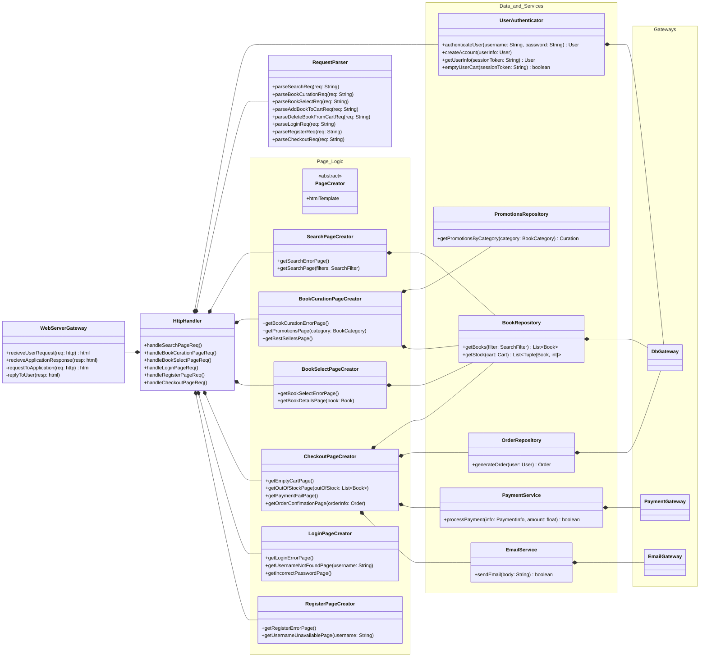

```mermaid
classDiagram
    direction LR
    
    class WebServerGateway {
        +recieveUserRequest(req: http) html
        +recieveApplicationResponse(resp: html)
        -requestToApplication(req: http) html
        -replyToUser(resp: html)
    }

    class HttpHandler {
        +handleSearchPageReq()
        +handleBookCurationPageReq()
        +handleBookSelectPageReq()
        +handleLoginPageReq()
        +handleRegisterPageReq()
        +handleCheckoutPageReq()
    }

    WebServerGateway --* HttpHandler
    
    class RequestParser {
        +parseSearchReq(req: String)
        +parseBookCurationReq(req: String)
        +parseBookSelectReq(req: String)
        
        +parseAddBookToCartReq(req: String)
        +parseDeleteBookFromCartReq(req: String)
        
        +parseLoginReq(req: String)
        +parseRegisterReq(req: String)
        +parseCheckoutReq(req: String)
    }
    
    %% middleware?
    HttpHandler *-- UserAuthenticator
    HttpHandler *-- RequestParser

    namespace Page_Logic {
        class PageCreator {
            <<abstract>>
            +htmlTemplate
        }
        class SearchPageCreator {
            +getSearchErrorPage()
            +getSearchPage(filters: SearchFilter)
        }
        class BookCurationPageCreator {
            +getBookCurationErrorPage()
            +getPromotionsPage(category: BookCategory)
            +getBestSellersPage()
        }
        class BookSelectPageCreator {
            +getBookSelectErrorPage()
            +getBookDetailsPage(book: Book)
        }
        class LoginPageCreator {
            +getLoginErrorPage()
            +getUsernameNotFoundPage(username: String)
            +getIncorrectPasswordPage()
        }
        class RegisterPageCreator {
            +getRegisterErrorPage()
            +getUsernameUnavailablePage(username: String)
        }
        class CheckoutPageCreator {
            +getEmptyCartPage()
            +getOutOfStockPage(outOfStock: List~Book~)
            +getPaymentFailPage()
            +getOrderConfimationPage(orderInfo: Order)
        }
    }

    %% Handler uses Creators
    HttpHandler *-- SearchPageCreator
    HttpHandler *-- BookCurationPageCreator
    HttpHandler *-- BookSelectPageCreator
    HttpHandler *-- CheckoutPageCreator
    HttpHandler *-- LoginPageCreator
    HttpHandler *-- RegisterPageCreator

    namespace Data_and_Services {
        class UserAuthenticator {
            +authenticateUser(username: String, password: String) User
            +createAccount(userInfo: User)
            +getUserInfo(sessionToken: String) User
            +emptyUserCart(sessionToken: String) boolean
        }
        class BookRepository {
            +getBooks(filter: SearchFilter) List~Book~
            +getStock(cart: Cart) List~Tuple[Book, int]~
        }
        class OrderRepository {
            +generateOrder(user: User) Order
        }
        class PromotionsRepository {
            +getPromotionsByCategory(category: BookCategory) Curation
        }
        class PaymentService {
            +processPayment(info: PaymentInfo, amount: float) boolean
        }
        class EmailService {
            +sendEmail(body: String) boolean
        }
    }

    %% Creators use Services
    BookCurationPageCreator *-- PromotionsRepository

    SearchPageCreator *-- BookRepository
    BookCurationPageCreator *-- BookRepository
    BookSelectPageCreator *-- BookRepository
    
    CheckoutPageCreator *-- BookRepository
    CheckoutPageCreator *-- OrderRepository
    CheckoutPageCreator *-- PaymentService
    CheckoutPageCreator *-- EmailService

    namespace Gateways {
        class DbGateway
        class PaymentGateway
        class EmailGateway
    }
    
    UserAuthenticator *-- DbGateway
    OrderRepository *-- DbGateway
    BookRepository *-- DbGateway

    PaymentService *-- PaymentGateway
    EmailService *-- EmailGateway

```
