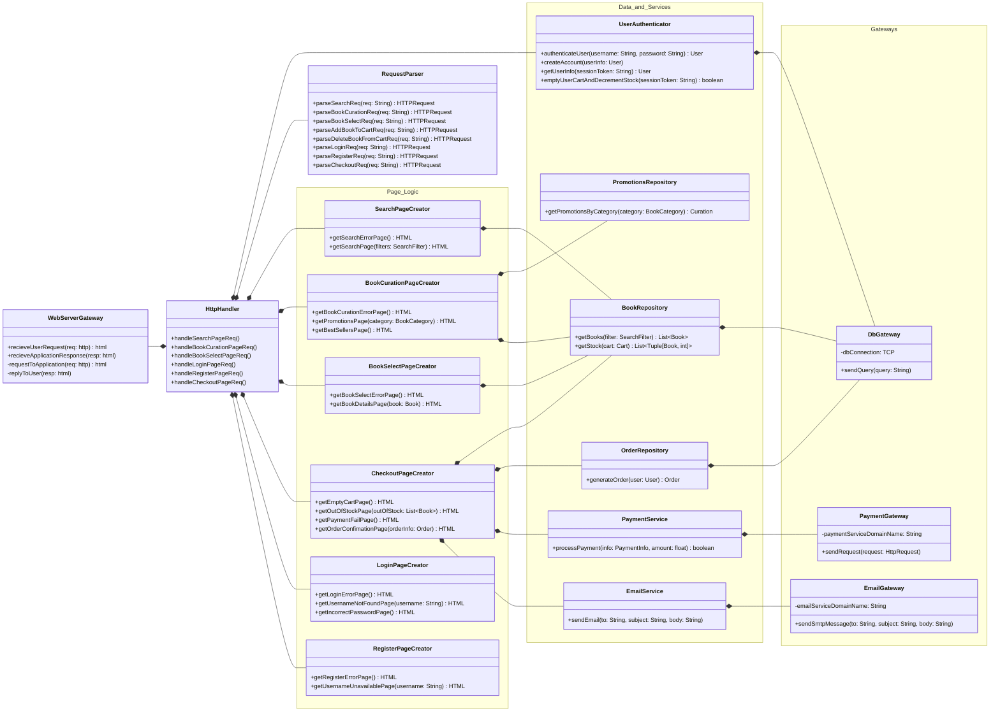

[Go back to index](README.md)

# Controller Class Diagram

```mermaid
classDiagram
    direction LR
    
    class WebServerGateway {
        +recieveUserRequest(req: http) html
        +recieveApplicationResponse(resp: html)
        -requestToApplication(req: http) html
        -replyToUser(resp: html)
    }

    class HttpHandler {
        +handleSearchPageReq()
        +handleBookCurationPageReq()
        +handleBookSelectPageReq()
        +handleLoginPageReq()
        +handleRegisterPageReq()
        +handleCheckoutPageReq()
    }

    WebServerGateway --* HttpHandler
    
    class RequestParser {
        +parseSearchReq(req: String) HTTPRequest
        +parseBookCurationReq(req: String) HTTPRequest
        +parseBookSelectReq(req: String) HTTPRequest
        
        +parseAddBookToCartReq(req: String) HTTPRequest
        +parseDeleteBookFromCartReq(req: String) HTTPRequest
        
        +parseLoginReq(req: String) HTTPRequest
        +parseRegisterReq(req: String) HTTPRequest
        +parseCheckoutReq(req: String) HTTPRequest
    }
    
    %% To authenticate and parse requests
    HttpHandler *-- UserAuthenticator
    HttpHandler *-- RequestParser

    namespace Page_Logic {
        class SearchPageCreator {
            +getSearchErrorPage() HTML
            +getSearchPage(filters: SearchFilter) HTML
        }
        class BookCurationPageCreator {
            +getBookCurationErrorPage() HTML
            +getPromotionsPage(category: BookCategory) HTML
            +getBestSellersPage() HTML
        }
        class BookSelectPageCreator {
            +getBookSelectErrorPage() HTML
            +getBookDetailsPage(book: Book) HTML
        }
        class LoginPageCreator {
            +getLoginErrorPage() HTML
            +getUsernameNotFoundPage(username: String) HTML
            +getIncorrectPasswordPage() HTML
        }
        class RegisterPageCreator {
            +getRegisterErrorPage() HTML
            +getUsernameUnavailablePage(username: String) HTML
        }
        class CheckoutPageCreator {
            +getEmptyCartPage() HTML
            +getOutOfStockPage(outOfStock: List~Book~) HTML
            +getPaymentFailPage() HTML
            +getOrderConfimationPage(orderInfo: Order) HTML
        }
    }

    %% Handlers use PageCreators
    HttpHandler *-- SearchPageCreator
    HttpHandler *-- BookCurationPageCreator
    HttpHandler *-- BookSelectPageCreator
    HttpHandler *-- CheckoutPageCreator
    HttpHandler *-- LoginPageCreator
    HttpHandler *-- RegisterPageCreator

    namespace Data_and_Services {
        class UserAuthenticator {
            +authenticateUser(username: String, password: String) User
            +createAccount(userInfo: User)
            +getUserInfo(sessionToken: String) User
            +emptyUserCartAndDecrementStock(sessionToken: String) boolean
        }
        class BookRepository {
            +getBooks(filter: SearchFilter) List~Book~
            +getStock(cart: Cart) List~Tuple[Book, int]~
        }
        class OrderRepository {
            +generateOrder(user: User) Order
        }
        class PromotionsRepository {
            +getPromotionsByCategory(category: BookCategory) Curation
        }
        class PaymentService {
            +processPayment(info: PaymentInfo, amount: float) boolean
        }
        class EmailService {
            +sendEmail(to: String, subject: String, body: String)
        }
    }

    %% PageCreators use Repositories and Services
    BookCurationPageCreator *-- PromotionsRepository

    SearchPageCreator *-- BookRepository
    BookCurationPageCreator *-- BookRepository
    BookSelectPageCreator *-- BookRepository
    
    CheckoutPageCreator *-- BookRepository
    CheckoutPageCreator *-- OrderRepository
    CheckoutPageCreator *-- PaymentService
    CheckoutPageCreator *-- EmailService

    namespace Gateways {
        class DbGateway{
            -dbConnection: TCP
            +sendQuery(query: String)
        }
        class PaymentGateway{
            -paymentServiceDomainName: String
            +sendRequest(request: HttpRequest)
        }
        class EmailGateway {
            -emailServiceDomainName: String
            +sendSmtpMessage(to: String, subject: String, body: String)
        }
    }

    %% Repositories and Services use Gateways
    UserAuthenticator *-- DbGateway
    OrderRepository *-- DbGateway
    BookRepository *-- DbGateway

    PaymentService *-- PaymentGateway
    EmailService *-- EmailGateway
```
