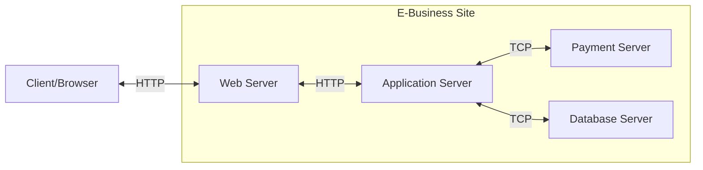

```mermaid
graph LR
    Client[Client/Browser]

    subgraph "E-Business Site"
        WebServer[Web Server]
        AppServer[Application Server]
        PaymentServer[Payment Server]
        DBServer[Database Server]
    end

    Client <-- HTTP --> WebServer
    WebServer <-- HTTP --> AppServer
    AppServer <-- TCP --> DBServer
    AppServer <-- TCP --> PaymentServer
```