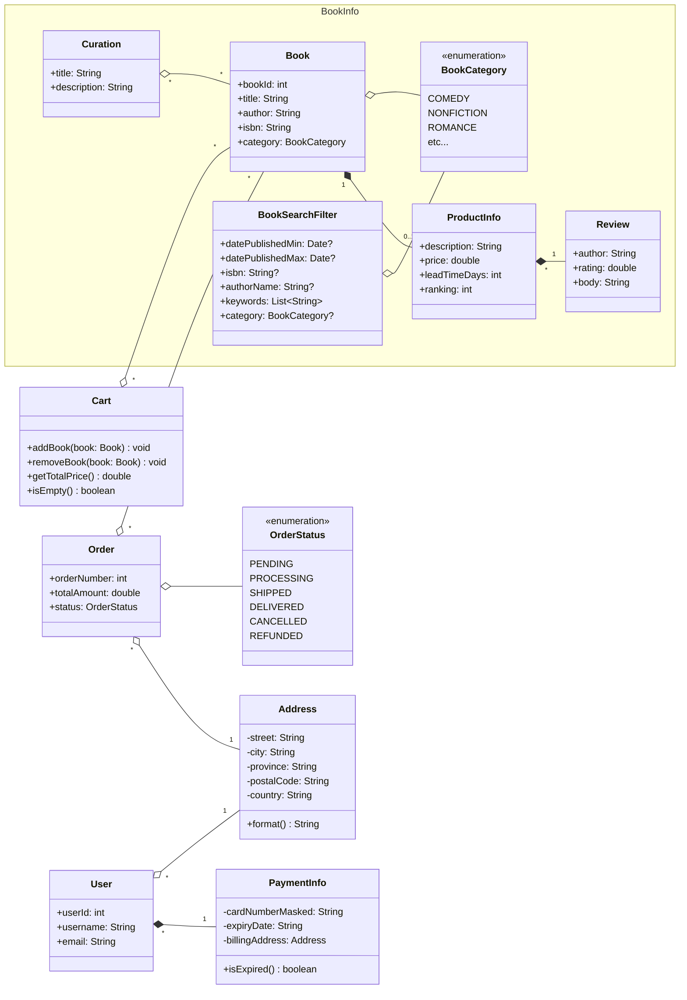
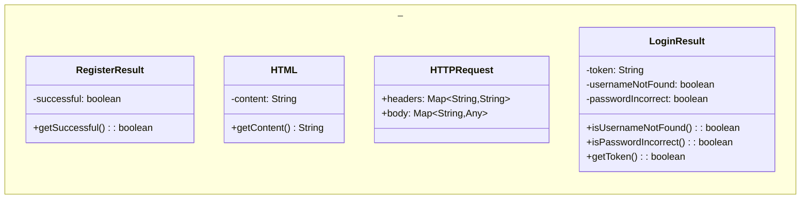

[Go back to index](README.md)

# Entity Class Diagram

```mermaid
classDiagram
    direction LR

    namespace BookInfo {
        class Book {
            +bookId: int
            +title: String
            +author: String
            +isbn: String
            +category: BookCategory
        }

        %% Book has Product Info
        class ProductInfo {
            +description: String
            +price: double
            +leadTimeDays: int
            +ranking: int
        }

        %% Product Info has 0 or more Reviews
        class Review {
            +author: String
            +rating: double
            +body: String
        }

        class BookCategory {
            <<enumeration>>
            COMEDY
            NONFICTION
            ROMANCE
            etc...
        }

        class Curation {
            +title: String
            +description: String
        }

        class BookSearchFilter {
            +datePublishedMin: Date?
            +datePublishedMax: Date?
            +isbn: String?
            +authorName: String?
            +keywords: List~String~
            +category: BookCategory?
        }

        
    }

    class Cart {
        +addBook(book: Book) void
        +removeBook(book: Book) void
        +getTotalPrice() double
        +isEmpty() boolean
    }

    class Order {
        +orderNumber: int
        +totalAmount: double
        +status: OrderStatus
    }

    class OrderStatus {
        <<enumeration>>
        PENDING
        PROCESSING
        SHIPPED
        DELIVERED
        CANCELLED
        REFUNDED
    }

    class User {
        +userId: int
        +username: String
        +email: String
    }

    class PaymentInfo {
        -cardNumberMasked: String
        -expiryDate: String
        -billingAddress: Address
        +isExpired() boolean
    }

    class Address {
        -street: String
        -city: String
        -province: String
        -postalCode: String
        -country: String
        +format() String
    }
        
    Cart "*" o-- "*" Book
    Book "1" *-- "0..1" ProductInfo

    Order "*" o-- "*" Book
    Order "*" o-- "1" Address

    User "*" *-- "1" PaymentInfo
    User "*" o-- "1" Address

    Curation "*" o-- "*" Book

    Book o-- BookCategory
    BookSearchFilter o-- BookCategory

    ProductInfo "*" *-- "1" Review
    Order o-- OrderStatus
```
## Standalone Entities

```mermaid
classDiagram
    direction LR

    namespace _ {
        class RegisterResult {
            -successful: boolean
            +getSuccessful(): boolean
        }

        class HTML {
            -content: String
            +getContent() String
        }

        class HTTPRequest {
            +headers: Map~String,String~
            +body: Map~String,Any~
        }

        class LoginResult {
            -token: String
            -usernameNotFound: boolean
            -passwordIncorrect: boolean
            +isUsernameNotFound(): boolean
            +isPasswordIncorrect(): boolean
            +getToken(): boolean
        }
    }
```