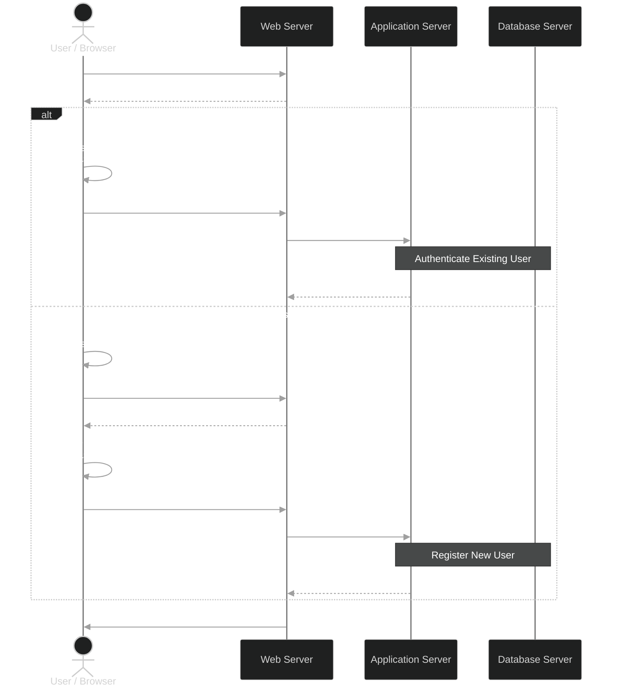
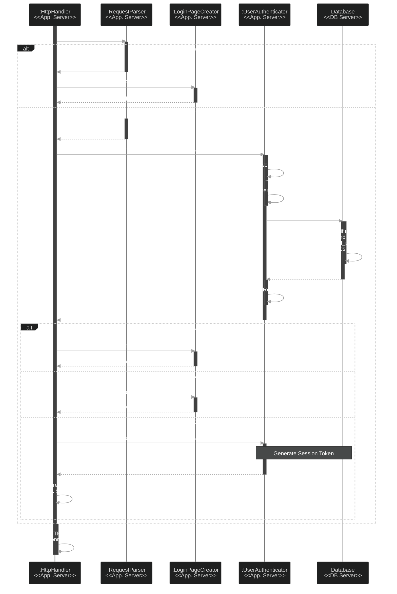
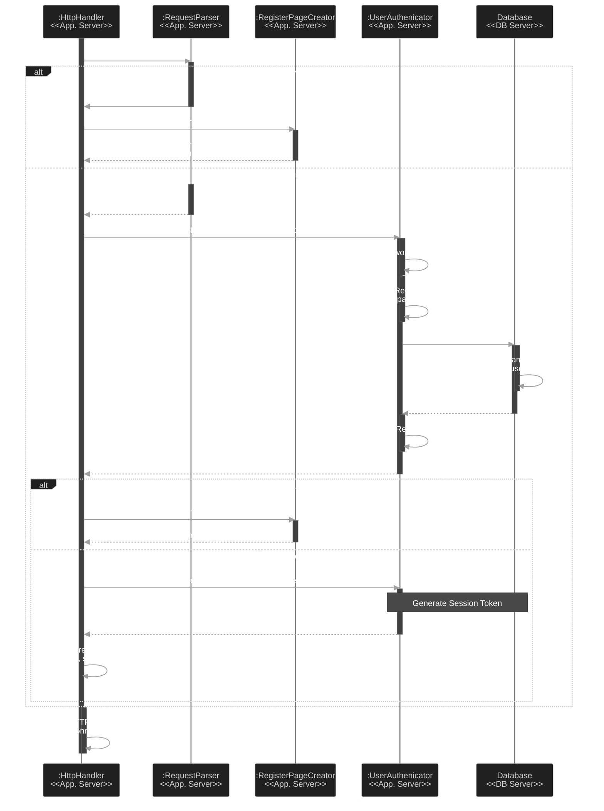
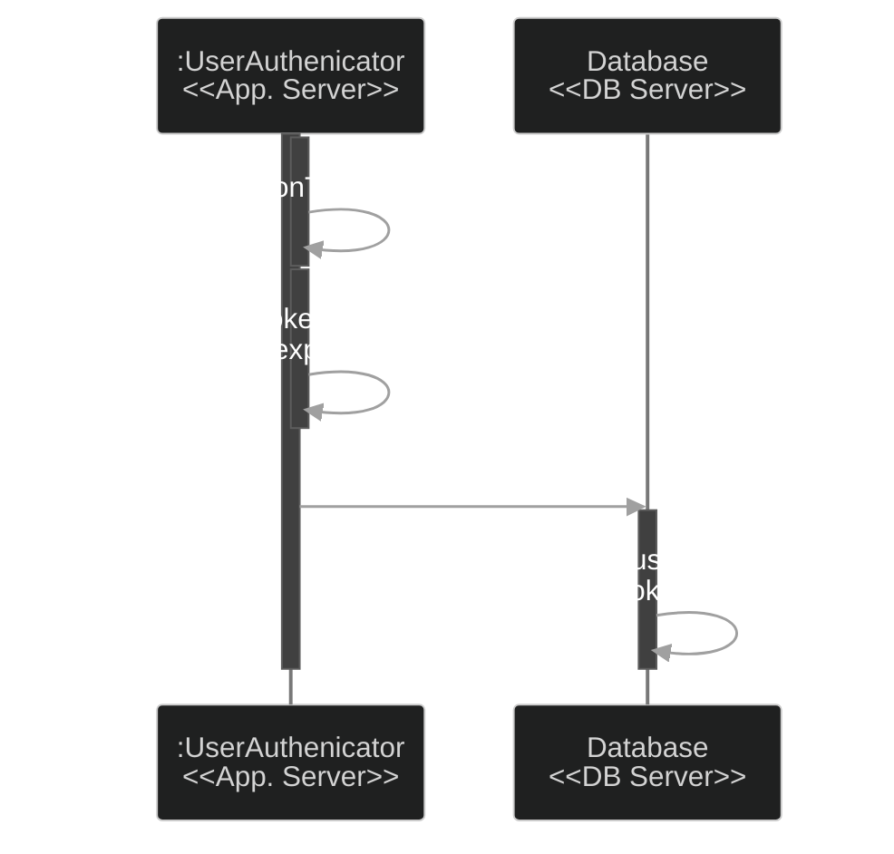

# Login/Register

## Authenticate Existing User
UserAuthenticator requires configuration: token validity duration

SessionTokenValidityDurationSeconds: 143243290

## Register New User

## Generate Session Token
