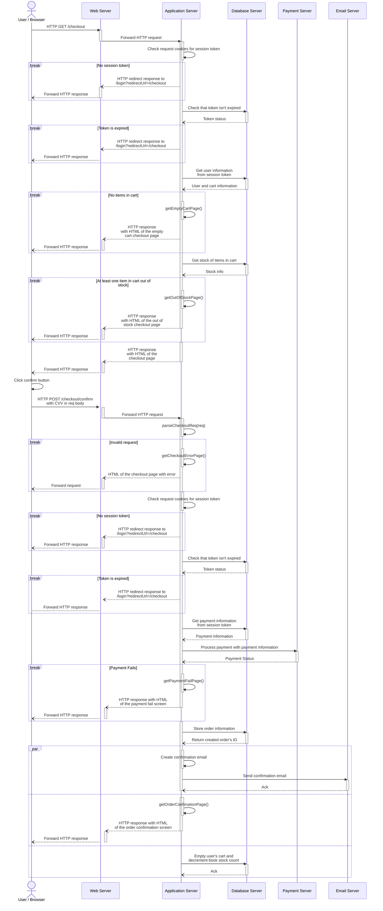

[Go back to index](README.md)

# Pay

```mermaid
sequenceDiagram
    actor U as User / Browser
    participant W as Web Server
    participant A as Application Server
    participant DB as Database Server
    participant P as Payment Server
    participant E as Email Server
    
    U ->> W: HTTP GET /checkout
    activate W
    W ->> A: Forward HTTP request
    deactivate W
    activate A
    
    activate A
    A->>A: Check request cookies for session token
    deactivate A

    break No session token
        A--)W: HTTP redirect response to<br>/login?redirectUrl=/checkout
        activate W
        W --) U: Forward HTTP response 
        deactivate W
    end

    %% Session token is present
    A ->> DB: Check that token isn't expired
    activate DB
    DB --) A: Token status
    deactivate DB

    break Token is expired
        A--)W: HTTP redirect response to<br>/login?redirectUrl=/checkout
        activate W
        W--)U: Forward HTTP response
        activate W
    end

    %% Token isn't expired
    A ->> DB: Get user information<br>from session token
    activate DB
    DB --) A: User and cart information
    deactivate DB

    break No items in cart
        activate A
            A ->> A: getEmptyCartPage()
        deactivate A
        A --) W: HTTP response <br> with HTML of the empty<br>cart checkout page
        activate W
        W --) U: Forward HTTP response 
        deactivate W
    end

    %% There are items in the cart
    A ->> DB: Get stock of items in cart
    activate DB
    DB --) A: Stock info
    deactivate DB

    break At least one item in cart out of stock
            activate A
            A ->> A: getOutOfStockPage()
            deactivate A
        A --) W: HTTP response <br> with HTML of the out of<br> stock checkout page
        activate W
        deactivate A
        W --) U: Forward HTTP response
        deactivate W
    end
    activate A

    %% All cart items are in stock
    A --) W: HTTP response <br> with HTML of the<br>checkout page
    activate W
    deactivate A
    W --) U: Forward HTTP response
    deactivate W

    U ->> U: Click confirm button
    U ->> W: HTTP POST /checkout/confirm <br>with CVV in req body
    activate W
    W ->> A: Forward HTTP request
    deactivate W
    activate A

    activate A
    A->>A: parseCheckoutReq(req)
    deactivate A

    break Invalid request
        activate A
            A ->> A: getCheckoutErrorPage()
        deactivate A
        A--)W: HTML of the checkout page with error
        activate W
        W--)U: Forward request
        deactivate W
    end
    
    %% Checkout request is valid
    activate A
    A->>A: Check request cookies for session token
    deactivate A

    break No session token
        A--)W: HTTP redirect response to<br>/login?redirectUrl=/checkout
        activate W
        W --) U: Forward HTTP response 
        deactivate W
    end

    %% Session token present
    A ->> DB: Check that token isn't expired
    activate DB
    DB --) A: Token status
    deactivate DB

    break Token is expired
        A--)W: HTTP redirect response to<br>/login?redirectUrl=/checkout
        activate W
        W-->U: Forward HTTP response
        activate W
    end

    %% Token is not expired
    A ->> DB: Get payment information<br>from session token
    activate DB
    DB --) A: Payment information
    deactivate DB

    A ->> P: Process payment with payment information
    activate P
    P --) A: Payment Status
    deactivate P

    break Payment Fails
            activate A
            A ->> A: getPaymentFailPage()
            deactivate A
        A --) W: HTTP response with HTML <br> of the payment fail screen
        activate W
        deactivate A
        W --) U: Forward HTTP response
        deactivate W
    end
    activate A

    %% Payment Succeeds
    A ->> DB: Store order information
    activate DB
    DB --) A: Return created order's ID
    deactivate DB

    par
        activate A
        A ->> A: Create confirmation email
        deactivate A
        A ->> E: Send confirmation email
        activate E
        E --) A: Ack
        deactivate E
        deactivate A
    and
        activate A
            activate A
            A ->> A: getOrderConfimationPage()
            deactivate A
        A --) W: HTTP response with HTML <br> of the order confirmation screen
        activate W
        deactivate A
        W --) U: Forward HTTP response
        deactivate W
    and
        A ->> DB: Empty user's cart and <br>decrement book stock count
        activate DB
        DB --) A: Ack
        deactivate DB
    end
```