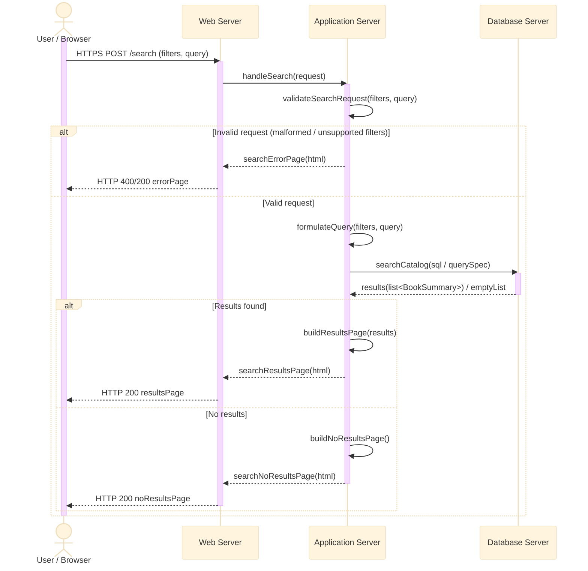

```mermaid
%%{init: {"theme":"base","themeVariables":{"background":"#f7f7f7"},"sequence":{"messageFontSize":14,"actorFontSize":14}}}%%

sequenceDiagram
    actor U as User / Browser
    participant W as Web Server
    participant A as Application Server
    participant D as Database Server

    activate U
    U->>W: HTTPS POST /search (filters, query)
    activate W
    W->>A: handleSearch(request)
    activate A

    A->>A: validateSearchRequest(filters, query)

    alt Invalid request (malformed / unsupported filters)
        A-->>W: searchErrorPage(html)
        W-->>U: HTTP 400/200 errorPage
    else Valid request
        A->>A: formulateQuery(filters, query)

        A->>D: searchCatalog(sql / querySpec)
        activate D
        D-->>A: results(list<BookSummary>) / emptyList
        deactivate D

        alt Results found
            A->>A: buildResultsPage(results)
            A-->>W: searchResultsPage(html)
            W-->>U: HTTP 200 resultsPage
        else No results
            A->>A: buildNoResultsPage()
            A-->>W: searchNoResultsPage(html)
            deactivate A
            W-->>U: HTTP 200 noResultsPage
            deactivate W
        end
    end

    deactivate U
```

