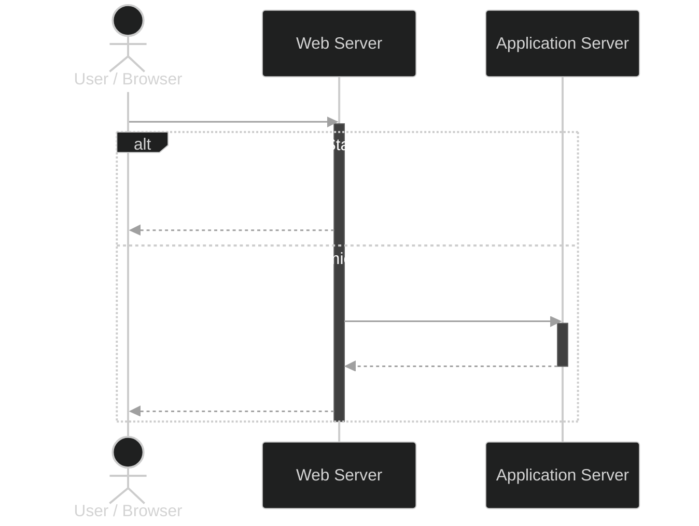
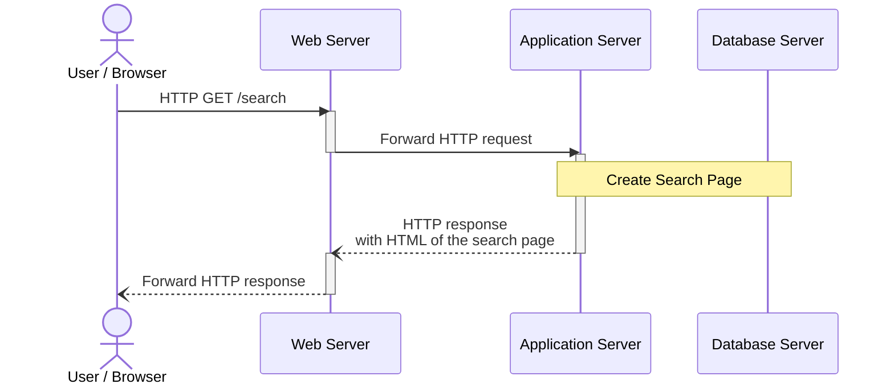
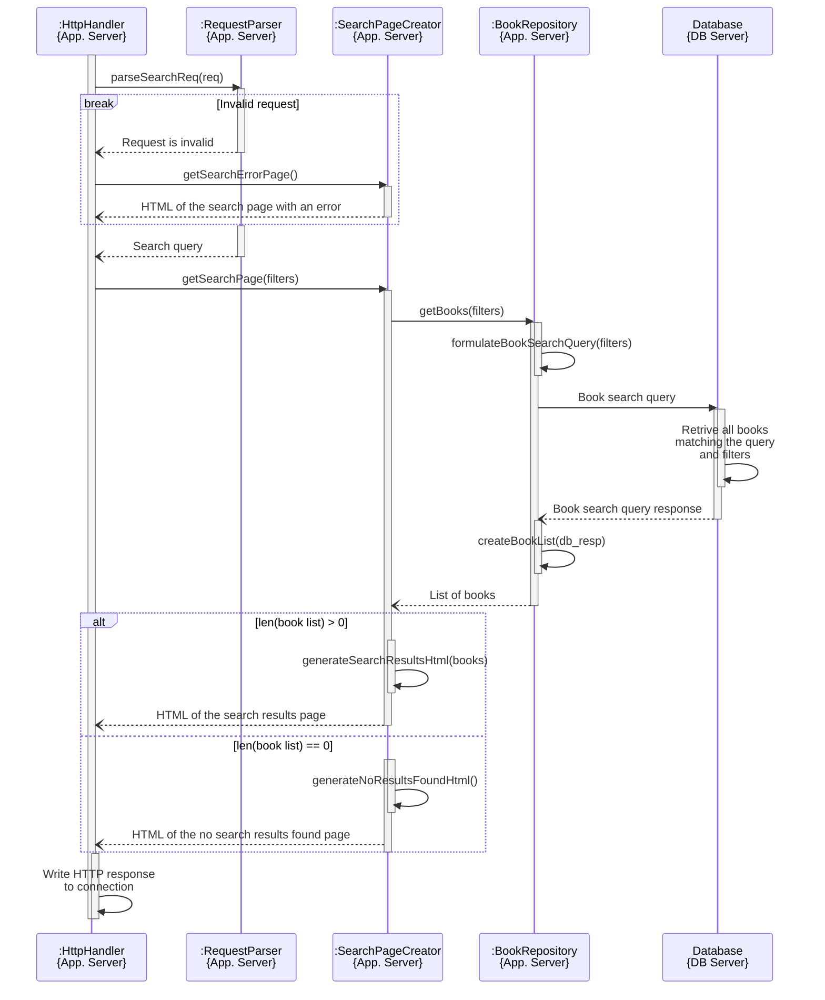

## theme
```
%%{init: {
  "theme":"base",
  "themeVariables": {
    "primaryColor": "#ffffff",
    "background": "#ffffff",
    
    "actorBkg": "#2b9f52",
    "actorBorder": "#2999ef",
    "actorTextColor": "#ffffff",
    "actorLineColor": "#ef920f",

    "signalColor": "#00ff00",
    "signalTextColor": "#ee1111",
    
    "noteBkgColor": "rgba(176, 16, 16, 0.7)",
    "noteTextColor": "#bf11e2",

    "activationBkgColor": "#ffff00",
    "activationBorderColor": "#000000",

    "loopLineColor": "#ff00ff",
    "loopTextColor": "#0000ff",
    "labelBoxBkgColor": "#e6e6e6",
    "labelBoxBorderColor": "#ff00ff"
  }
}}%%
```

%%{init: {
  "theme": "default",
  "themeVariables": {
    "actorBkg": "#6DB1FF",
    "actorBorder": "#f2a7c6",
    "primaryColor": "#e6f0ff",
    "primaryBorderColor": "#f2a7c6",
    "activationBkgColor": "#ced4db",
    "activationBorderColor": "#1BC8B1",
    "lineColor": "#000000",
    "textColor": "#ffffff",
    "backgroundColor": "#ffffff"
  }
}}%%


## server side rendering moment
```nginx
root /var/www/html/public; # Your static file directory

location / {
    # 1. Try to find the exact file ($uri)
    # 2. Try to find a directory with that name ($uri/)
    # 3. If neither exists, send to the named location @app
    try_files $uri $uri/ @app;
}

location @app {
    proxy_pass http://127.0.0.1:8080;
    proxy_set_header Host $host;
}
```

## High level architecture


## Search


## Create Search Page
