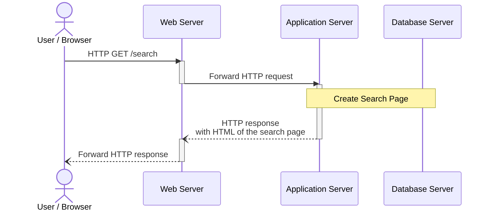
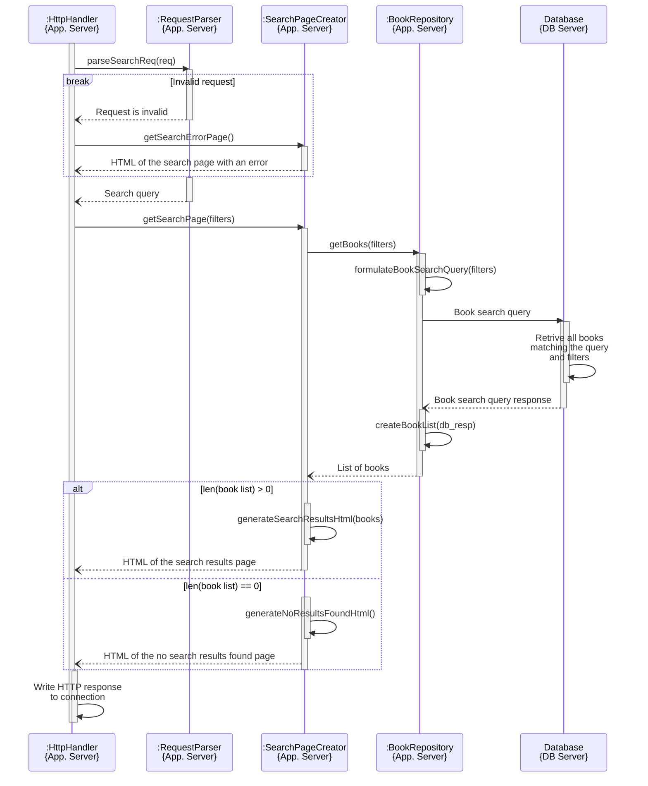

[Go back to index](README.md)

# Search

```mermaid
sequenceDiagram
    actor U as User / Browser
    participant W as Web Server
    participant A as Application Server
    participant DB as Database Server

    U->>W: HTTP GET /search
    activate W
    W->>A: Forward HTTP request
    deactivate W
    activate A
    note over A, DB: Create Search Page
    A--)W: HTTP response <br> with HTML of the search page
    deactivate A
    activate W
    W--)U: Forward HTTP response
    deactivate W
```

## Create Search Page

```mermaid
sequenceDiagram
    participant H as :HttpHandler<br> {App. Server}
    participant P as :RequestParser<br> {App. Server}
    participant S as :SearchPageCreator<br> {App. Server}
    participant Repo as :BookRepository<br> {App. Server}
    participant DB as Database<br>{DB Server}

    activate H
    H->>P: parseSearchReq(req)
    activate P

    break Invalid request
        P--)H: Request is invalid
        deactivate P
        H->>S: getSearchErrorPage()
        activate S
        S--)H: HTML of the search page with an error
        deactivate S
    end

    %% Request is valid
    activate P
    P--)H: Search query
    deactivate P
    H->>S: getSearchPage(filters)
    activate S

    S->>Repo: getBooks(filters)
    activate Repo

    activate Repo
    Repo->>Repo: formulateBookSearchQuery(filters)
    deactivate Repo

    Repo->>DB: Book search query
    activate DB
        activate DB
        DB->>DB: Retrive all books<br> matching the query<br> and filters
        deactivate DB
    DB--)Repo: Book search query response
    deactivate DB

    activate Repo
    Repo->>Repo: createBookList(db_resp)
    deactivate Repo

    Repo--)S: List of books
    deactivate Repo

    alt len(book list) > 0
            activate S
            S->>S: generateSearchResultsHtml(books)
            deactivate S
        S--)H: HTML of the search results page
        deactivate S
    else len(book list) == 0
        activate S
            activate S
            S->>S: generateNoResultsFoundHtml()
            deactivate S
        S--)H: HTML of the no search results found page
    end
    deactivate S
    
    activate H
    H->>H: Write HTTP response<br>to connection
    deactivate H

    deactivate H
```